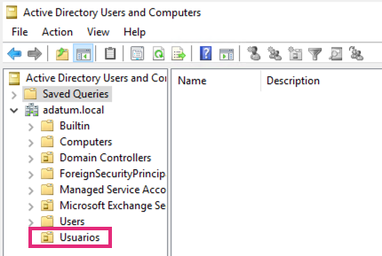
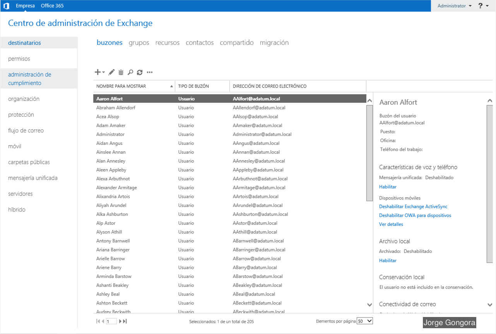
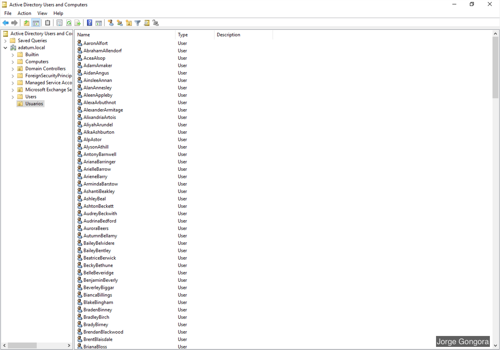

# Creación de buzones en Exchange Server

Los buzones de usuario son buzones de Exchange asociados a personas, normalmente un buzón por persona. 

Al crear un nuevo buzón de usuario en Exchange, también se crea el usuario de Active Directory

En este ejemplo vamos a crear 200 usuarios utilizando el Shell de administración de Exchange.

1. Crear una Unidad organizativa en la raiz de tu dominio llamado "Usuarios"

    

2. Copia el archivo [User-list.csv](./files/User-list.csv) en una carpeta en tu servidor de Exchange.

3. Ejecutar el Shell

    

4. Para obtener el nombre de nuestra base de datos ejecutar el siguiente comando:

    ```powershell
    Get-MailboxDatabase
    ```

4. Cambia la ubicación a la carpeta dónde guardaste [User-list.csv](./files/User-list.csv) y ejecuta los siguientes commandos:
    
    ```powershell
    $Password = Read-Host “Ingresa password para todos los usuarios” -AsSecureString
    ```

    ```powershell
    $Database = "Nombre de tu base de datos"
    ```
    > :warning: Aquí vamos a escribir el nombre de nuestra base de datos cuando ejecutamos el comando **Get-MailboxDatabase**

    ```powershell
    Import-CSV User-list.csv | ForEach {New-Mailbox -UserPrincipalName $_.UserPrincipalName -Alias $_.Alias -Name $_.Name -FirstName $_.FirstName -LastName $_.LastName -DisplayName $_.DisplayName -Database $Database -OrganizationalUnit Usuarios -Password $Password}
    ```

## Resultado
Finalmente veremos como se crearon todos nuestros buzones en Exchange server y active directory



