# Instalación Microsoft Exchange Server 2016

## Requisitos
1. [Virtualbox](https://www.virtualbox.org)
2. [Windows Server 2016](https://www.microsoft.com/es-xl/evalcenter/evaluate-windows-server-2016)
3. [Exchange Server 2016](https://www.google.com/url?sa=t&rct=j&q=&esrc=s&source=web&cd=&cad=rja&uact=8&ved=2ahUKEwj2xobGmdrwAhVKmK0KHVHiDN0QFjAAegQIAhAD&url=https%3A%2F%2Fwww.microsoft.com%2Fen-us%2Fdownload%2Fdetails.aspx%3Fid%3D57388&usg=AOvVaw321h9vVlI5oBfqDDKUoRnM)

## Requisitos Máquina virtual
1. Windows Server 2016
2. Tres discos duros virtuales:
    1. Un disco duro virtual de 100 GB para nuestro sistema operativo
    2. Un disco duro virtual de 100 GB para nuestros archivos logs transaccionales
    3. Un disco duro virtual de 200 GB para nuestra base de datos
3. RAM: 8GB
4. Controlador de dominio

## Creación máquina virtual
1. Clic en nueva
2. Escribir nombre de máquina

    

    > Para este ejemplo el nombre de mi máquina será **SRV-EXCH**
3. En tipo seleccionamos **Microsoft Windows** y en versión elegimos **Windows 2016 (64-bit)**

    

4. En **tamaño de memoria** elegimos 8 GB

    

5. En **Disco duro** seleccionamos la opción de **Crear un nuevo disco duro virtual ahora** y clic en **crear**

    

6. Seleccionamos el tamaño del disco duro virtual
    
    
    > En este ejemplo estoy seleccionado 100 GB

7. En **Tipo de archivo de disco duro** seleccionamos VDI
    
    

8. En **Almacenamiento en disco duro físico** seleccionamos **Reservado dinámicamente** y clic en **Continuar**
    
    


## Agregar archivo .ISO a nuestra máquina virtual
1. Seleccionar nuestra máquia virtual a la que le vamos agregar nuestro archivo .ISO
2. Clic derecho y seleccionamos la opción de **Configuración**

    

3. Clic en **Almacenamiento**

    

4. Clic en **Vacío** en el apartado de **Dispositivos de almacenamiento**

    

5. Clic en el icono de **disco** para seleccionar un disco óptico virtual, seleccionamos la opción **Seleccionar un archivo de disco** y seleccionamos nuestro archivo .ISO de windows server 2016.

    

## Agregar discos duros virtuales a nuestra máquina virtual
> :warning: En este ejemplo solo agregaremos dos discos duros virtuales ya que al momento de crear la máquina virtual hemos creado uno de 100 GB.
1. Seleccionar nuestra máquia virtual a la que le vamos agregar nuestros discos duros
2. Clic derecho y clic en **Configuración**

    

3. Clic en **Almacenamiento**

    

4. Clic para agregar un nuevo disco duro virtual

    

5. Clic en el botón de crear

    

6. En el tipo de archivo de disco duro seleccionamos la opción VDI y damos clic en **siguiente**

    

7. Seleccionamos **Reservado dinámicamente** y clic en **Continuar**

    

8. Seleccionamos el tamaño del disco duro virtual y clic en **Crear**
    
    
    > En este ejemplo estoy seleccionado 100 GB

9. Una vez creado seleccionamos el disco duro virtual y damos clic en **Seleccionar**

    

> :warning: Hacer el mismo procedimiento para agregar un disco duro virtual de 200 GB.

## Instalación windows server 2016
1. Clic en **Iniciar**

    

2. Seleccionamos el tiempo y método de entrada del teclado

    

3. Seleccionar **Windows Server 2016 Standard Evaluation (Desktop Experience)**

    

4. Aceptamos terminos de licencia
5. Selecionar opción **Personalizado**

    

6. Seleccionamos uno de los discos de 100 GB que agregamos previamente y damos clic en **Siguiente**

    

7. Esperamos a que se instale el sistema operativo.
8. Agregamos un password y clic en **Terminar**

    

## Configuración básica de nuestro servidor
1. Cambiar el nombre de nuestro servidor, abrir PowerShell y ejecutar el siguiente comando:
    ```powershell
    Rename-Computer -NewName "SRV-EXCH"
    ```
    Después de ejecutar el comando, ejecutar el siguiente comando para reiniciar nuestro servidor
    ```powershell
    Restart-Computer
    ```
2. Configuración de red de nuestro servidor
    |||
    |----|----|
    |IP address|192.168.0.10|
    |Mascara de subred|255.255.255.0|
    |Puerta de enlace predeterminada|192.168.0.1|
    |Servidor DNS|192.168.0.10|
3. Instalar ADDS
    1. Clic en **agregar roles y caracteristicas**

        

    2. Clic en siguiente
    3. Seleccionamos la opción **Instalación basada en funciones** y clic en siguiente

        

    4. Seleccionamos el servidor y clic en siguiente

        

    5. Seleccionamos el rol de **Active Directory Domain Services**, damos clic en **Agregar caracteristicas** y clic en siguiente

        

    6. Clic en siguiente
    7. Clic en instalar

        

4. Promover el servidor a controlador de dominio
    1. Una vez instalado el rol, clic en **Promover este servidor a controlador de dominio**

        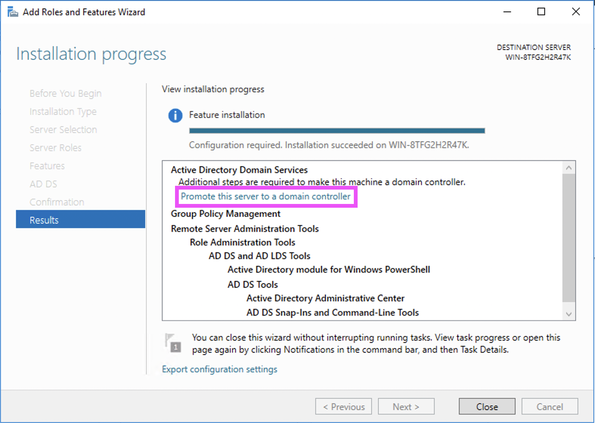
    
    2. Seleccionamos la opción **Agregar un nuevo bosque**, escribimos el nombre del dominio y clic en siguiente.

        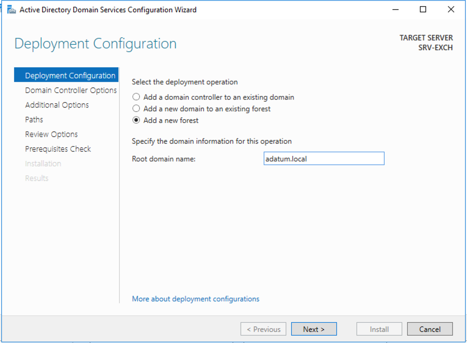
        > En este ejemplo se escribo el nombre **adatum.local**
    
    3. Escribimos una contraseña para DSRM

        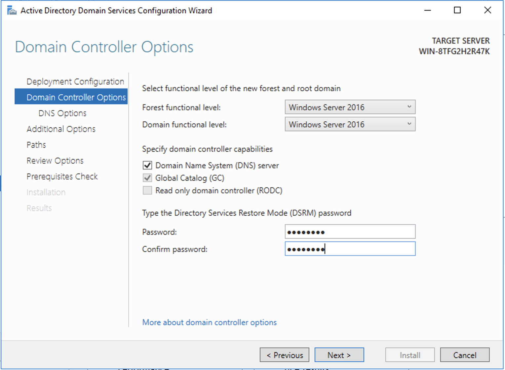
    
    4. Clic en siguiente
    5. Clic en **Instalar**

        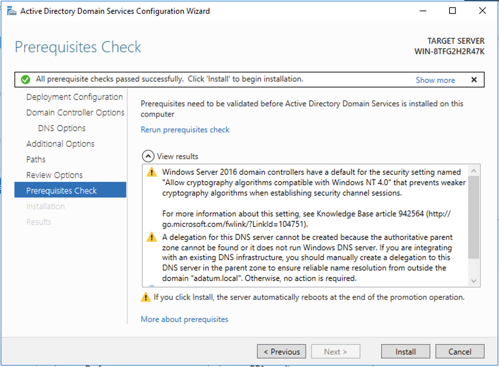


5. Instalar el siguiente software:
    - https://www.microsoft.com/en-US/download/details.aspx?id=56116
    - http://go.microsoft.com/fwlink/?LinkId=260990
    - https://www.microsoft.com/download/details.aspx?id=40784 

## Extender esquema de active directory
1. Montar ejecutable de exchange server en la máquina virtual
    1. Clic en la pestaña **Dispositivos**

    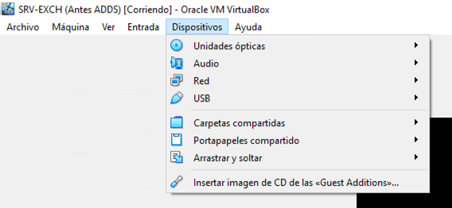

    2. Poner el cursor en la opción de **Unidades ópticas**

    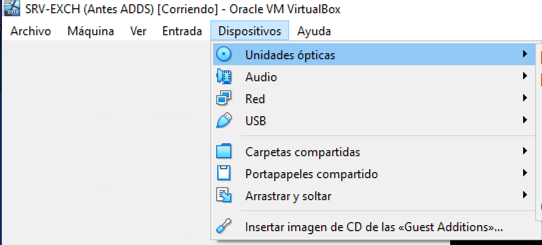

    3. Clic en **Seleccionar un archivo de disco** y buscamos el archivo de exchange server.

    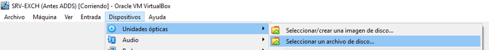

    4. Una vez montado el ISO de exchange server verificar en que unidad fue montado

    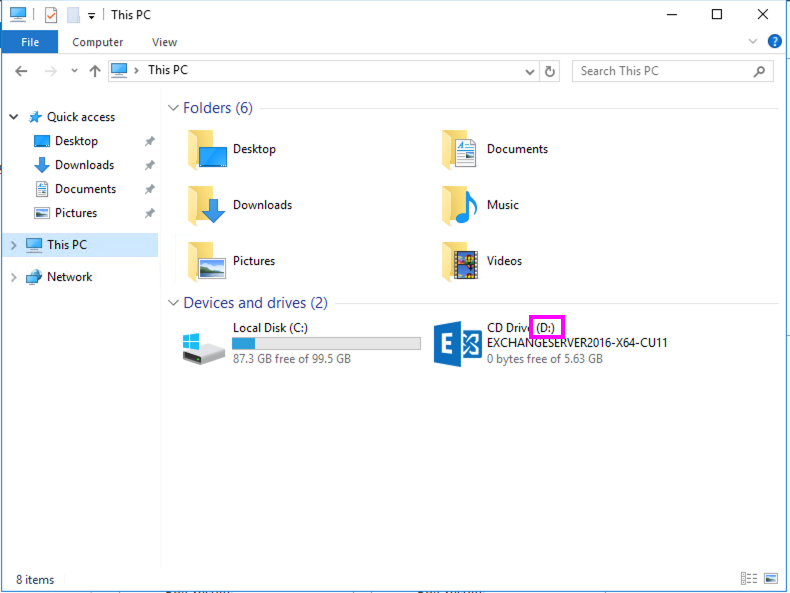
    > En este ejemplo la imagen de exchange server fue montada en la unidad D

2. Abrir powershell y correr el siguiente comando
    ```powershell
    Install-WindowsFeature RSAT-ADDS
    ```
3. Abrir cmd como administrador y correr el siguiente comando
    ```powershell
    D:
    ```
    > Aquí se esta haciendo referencia a la letra de la unidad en donde fue montada la imagen de exchange server
4. Una vez posicionados en la unidad correspondiente, ejecutar el siguiente comando
    ```powershell
    Setup.exe /PrepareSchema /IAcceptExchangeServerLicenseTerms
    ```
    y esperamos a que termine el proceso.

    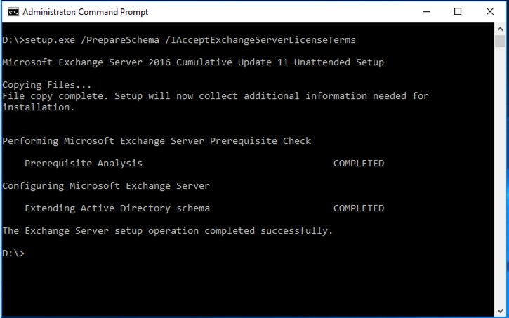

## Preparar el dominio para exchange server
1. Abrir cmd como administrador y correr el siguiente comando
    ```powershell
    Setup.exe /PrepareAD /OrganizationName:”Adatum” /IAcceptExchangeServerLicenseTerms
    ```
    > Aqui hay que poner el nombre de la organización, tiene que ser igual que el nombre del dominio.
    y esperamos a que termine el proceso.

    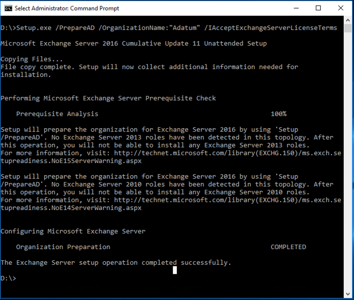

## Instalar pre-requisitos de exchange server

1. Abrir powershell y correr el siguiente comando
    ```powershell
    Install-WindowsFeature NET-Framework-45-Features, Server-Media-Foundation, RPC-over-HTTP-proxy, RSAT-Clustering, RSAT-Clustering-CmdInterface, RSAT-Clustering-Mgmt, RSAT-Clustering-PowerShell, WAS-Process-Model, Web-Asp-Net45, Web-Basic-Auth, Web-Client-Auth, Web-Digest-Auth, Web-Dir-Browsing, Web-Dyn-Compression, Web-Http-Errors, Web-Http-Logging, Web-Http-Redirect, Web-Http-Tracing, Web-ISAPI-Ext, Web-ISAPI-Filter, Web-Lgcy-Mgmt-Console, Web-Metabase, Web-Mgmt-Console, Web-Mgmt-Service, Web-Net-Ext45, Web-Request-Monitor, Web-Server, Web-Stat-Compression, Web-Static-Content, Web-Windows-Auth, Web-WMI, Windows-Identity-Foundation, RSAT-ADDS 
    ```
    y esperamos a que termine el proceso.
    
    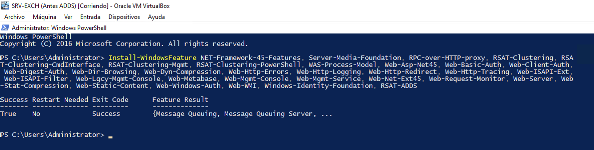

## Instalar Exchange Server

1. Doble clic en el ejecutable

    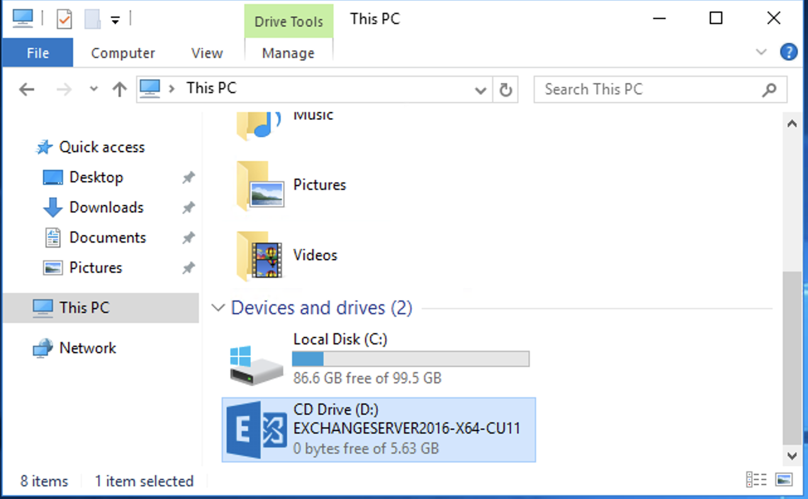
    
2. Clic en **No buscar actualizaciones** y clic en **siguiente**

    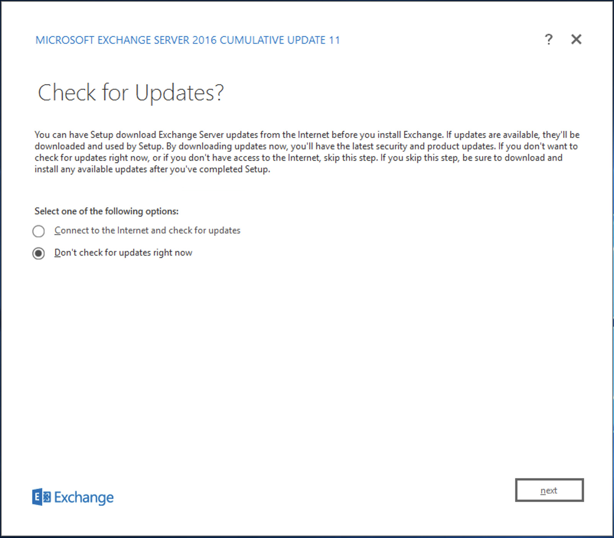

3. En el apartado de introducción damos clic en **siguiente** y aceptamos terminos y condiciones
4. Seleccionar opción **No usar configuraciones recomendadas** y clic en siguiente

    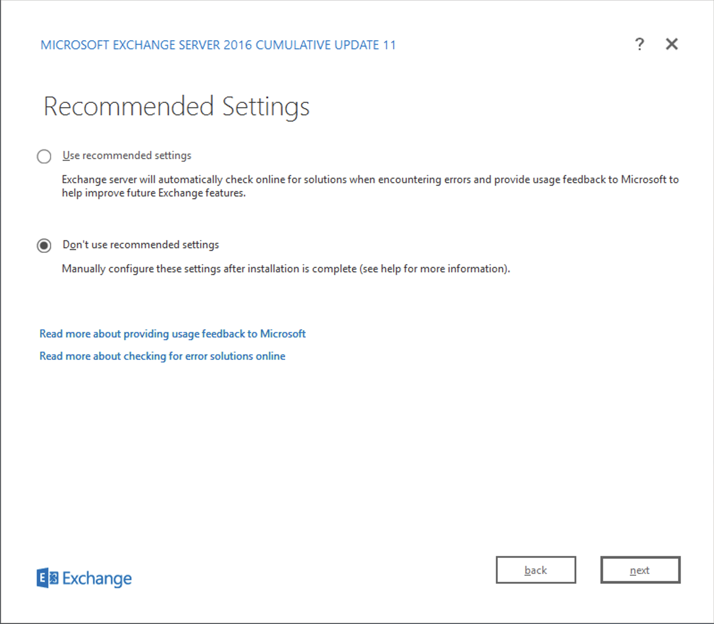

3. Seleccionar la opción de **mailbox rol** y seleccionar la opción de **Instalar automáticamente las funciones y características del servidor de Windows que se requieren para instalar Exchange Server** y clic en **siguiente**

    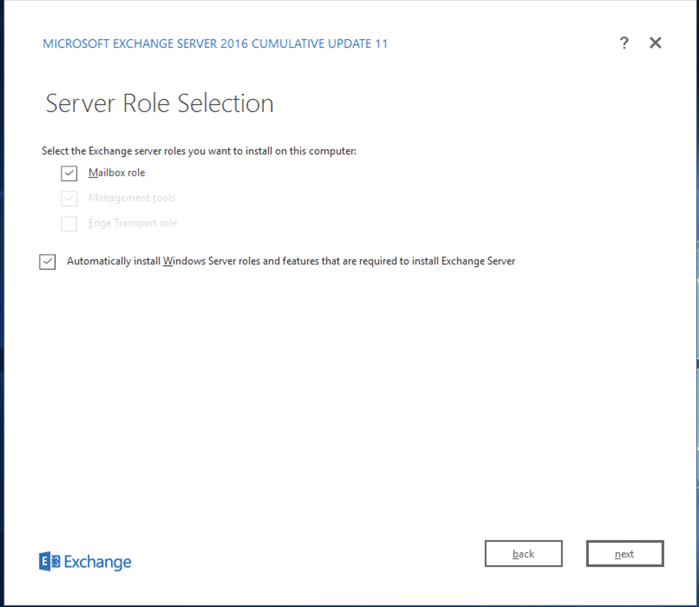

4. Clic en **siguiente** en las siguientes opciones
5. Esperar a que termine la instalación
6. Reiniciar servidor
7. Abrir IE y escribir la siguiente ruta https://srv-exch/owa
    > srv-exch es el nombre de mi servidor, si tu servidor tiene otro nombre cambia la ruta por el nombre de tu servidor.