# Migración de base de datos a un nuevo HDD

Cuando se instala Exchange Server 2016, se crea automáticamente una base de datos de buzones predeterminada en la ubicación de instalación predeterminada de Exchange, que es C:\Archivos de programa\Microsoft\Exchange Server\V15\Buzón.

Es una buena práctica almacenar la base de datos de buzones y los archivos de registro en una partición diferente a la partición del sistema con binarios de Exchange.

Si queremos mover los archivos de base de datos de buzones a otra ubicación, debemos usar el Shell de administración de Exchange. No hay una interfaz gráfica de usuario para mover una ubicación de base de datos de buzones.

1. Ejecutar Exchange Management Shell

    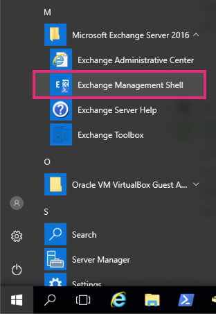

2. Ejecutar el siguiente comando para mostrar dónde se almacena actualmente nuestras base de datos y los archivos de registro.

    ```powershell
    Get-MailboxDatabase | fl Name,edbfilepath,logfolderpath
    ```

3. Cambiar el nombre de nuestra base de datos

    1. Ir a nuestro panel de exchange server, clic en **servidores** y clic en **Base de datos**

        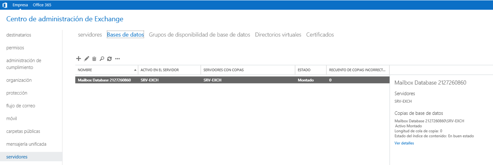

    2. Doble clic en el nombre de base de datos y lo cambiaremos a **Users Mailbox Database**

        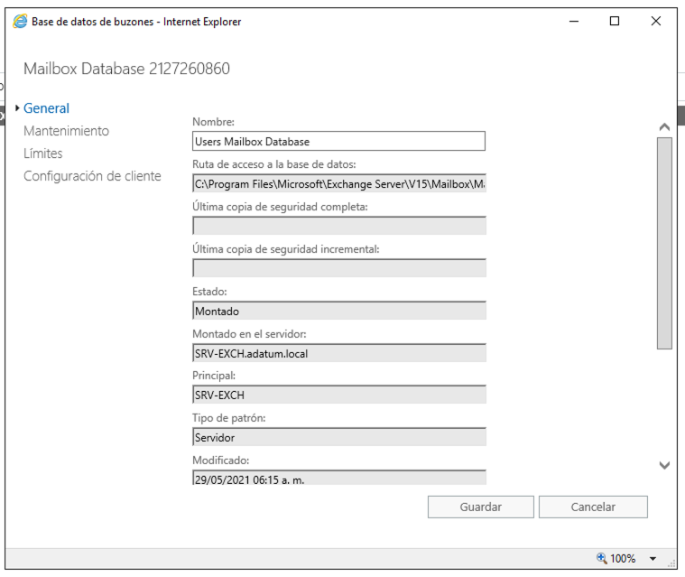

4. Inicializar nuestros discos duros que previamente agregamos a nuestro exchange server
    1. Clic en Administración de discos

        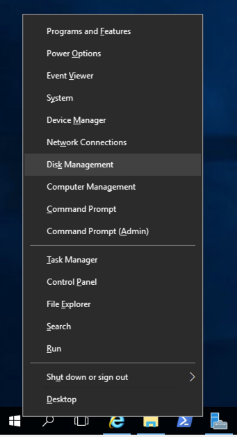

    2. Ir al disco que creamos, damos clic derecho y clic en **Inicializar disco** 

        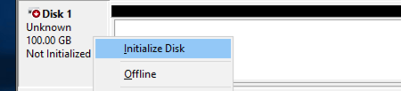

    3. Seleccionamos los dos discos y damos clic en **siguiente**

        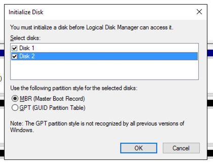

    4. Una vez inicializado veremos que el disco esta en estado **Online**

        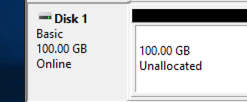

    5. Ahora vamos a crear un nuevo volumen simple para los dos discos, clic derecho y damos clic en **New Simple Volume**

        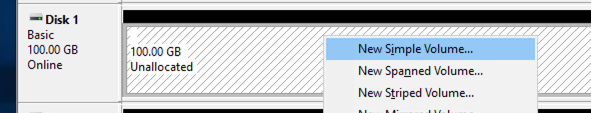

    6. Seleccionamos el tamaño por default

        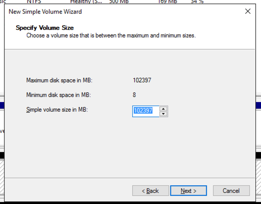

    7. Seleccionamos una letra en especifico para cada disco

        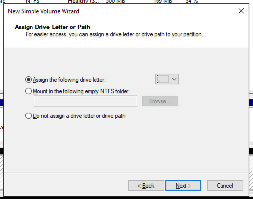

        > :warning: En este paso se uso la letra **L** para los logs transaccionales y la **B** para la base de datos.

    8. Vamos a seleccionar la opción **Do not format this volume**

        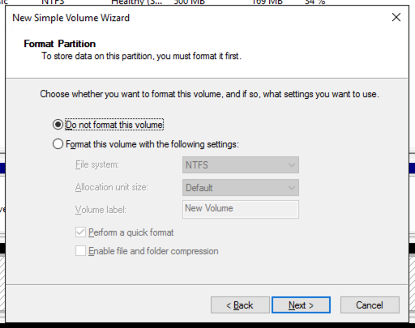

    9. Clic en **Finish**

        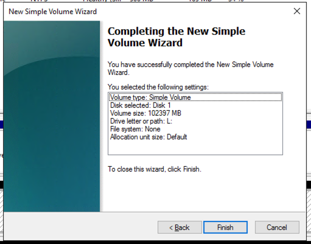

5. Darle formato a nuestros discos duros, ejecutar los siguientes comandos

    ```powershell
    Format-Volume -DriveLetter B -NewFileSystemLabel "Database" -FileSystem REFS -SetIntegrityStreams $false
    ```
    ```powershell
    Format-Volume -DriveLetter L -NewFileSystemLabel "Logs" -FileSystem REFS -SetIntegrityStreams $false
    ```

6. Dentro del disco de **Database** vamos a crear la siguiente carpeta:
    1. **Exchange Database**
    2. Dentro de la carpteta **Exchange Database** vamos a crear una carpeta con el combre de nuestra base de datos (**Users Mailbox Database**)

7. Dentro del disco de **Logs** vamos a crear la siguiente carpeta:
    1. **Exchange Logs**
    2. Dentro de la carpteta **Exchange Logs** vamos a crear una carpeta con el combre de nuestra base de datos (**Users Mailbox Database**)

7. Ir a nuestro Shell de Exchange server y ejecutar el siguiente comando

    ```powershell
    Move-DatabasePath -Identity "Users Mailbox Database" -EdbFilePath "B:\Exchange Database\Users Mailbox Database\Users Mailbox Database.edb" -LogFolderPath "L:\Exchange Logs\Users Mailbox Database\"
    ```